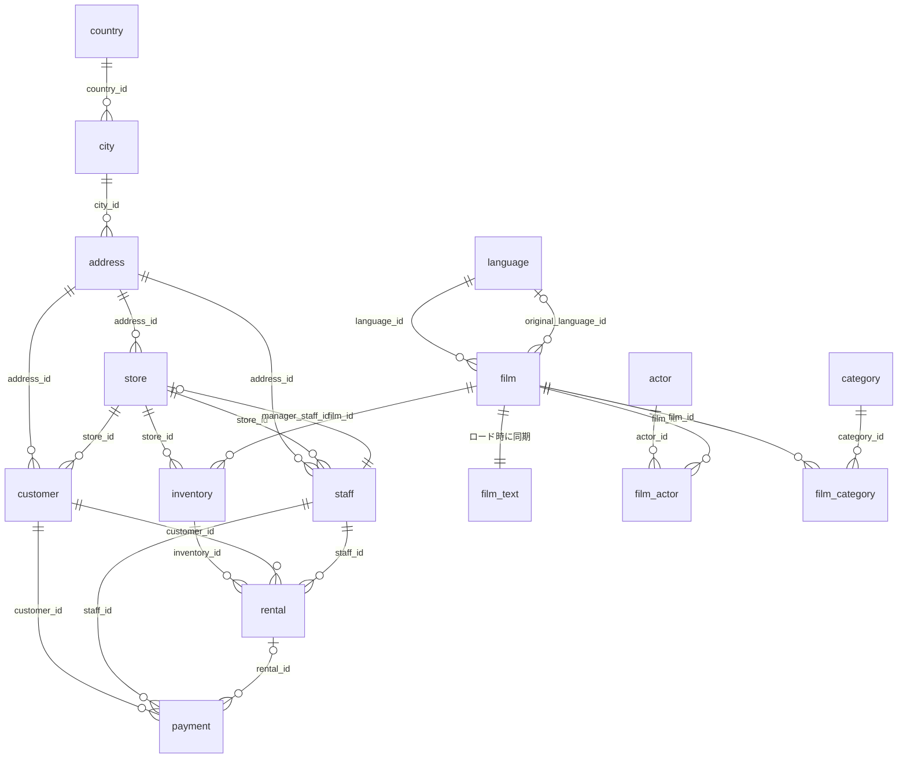

# sakila

## ER 図

## References

- [Sakila の公式テーブル一覧](https://dev.mysql.com/doc/sakila/en/sakila-structure-tables.html)
- [参照元の MySQL スキーマ](https://github.com/ivanceras/sakila/blob/master/mysql-sakila-db/sakila-schema.sql)
- [参照元の著作権表示と利用条件](LICENSE.sakila)
