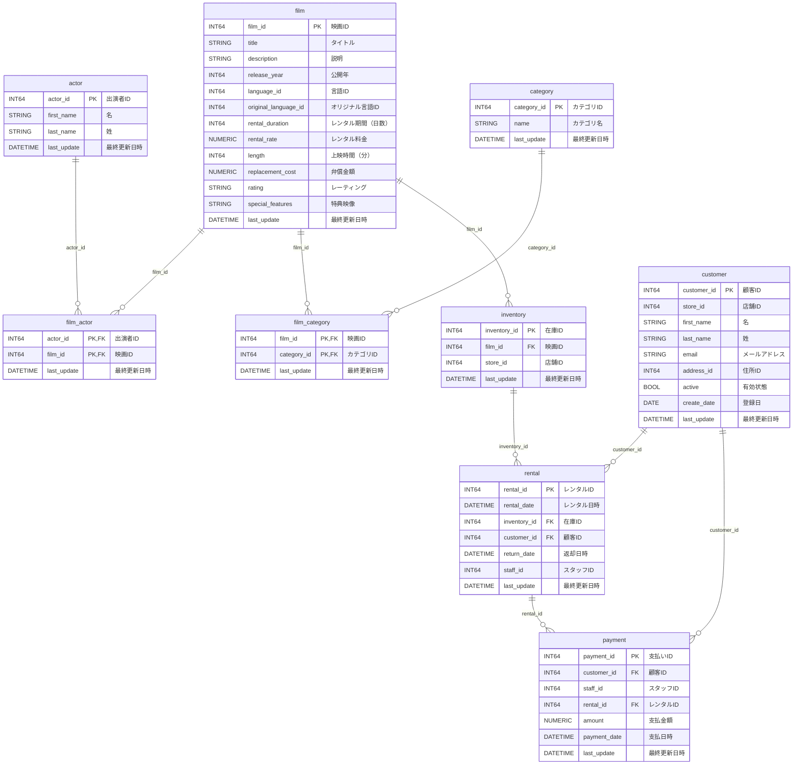

# sakila

Dataform の検証に使う Sakila の主要エンティティを BigQuery へ投入する。

投入先は Terraform が作成する `sakila_<suffix>_<environment>` データセットとなる。
同名の既存テーブルは検証用データで置き換える。

## Requirements

- Terraform による Sakila データセットの作成が完了していること
- `terraform`、`gcloud`、`bq` を利用できること
- Google Cloud CLI と Application Default Credentials で認証していること

## Usage

```bash
make sakila-load
```

既定では `config/dev.env.local` を使用する。別の設定を使う場合は、
`make sakila-load ENV_FILE=config/another.env.local` のように指定する。

## ER 図



## References

- [sakila](https://github.com/ivanceras/sakila)
